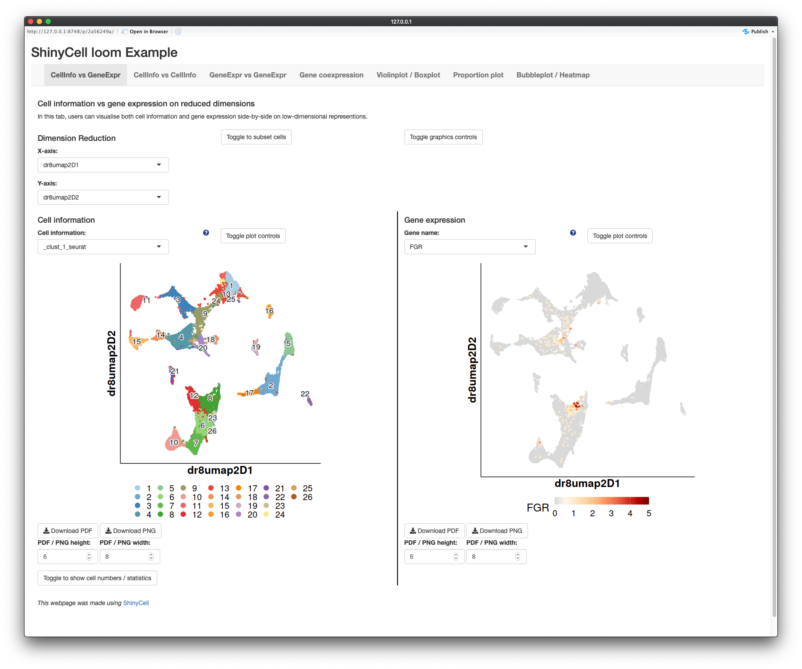

ShinyCell supports all four common single-cell data formats, namely h5ad, 
loom, SCE and Seurat. In our other tutorials, we focused on using Seurat 
objects as inputs. Here, we will explain how to use the other supported file 
formats to create shiny apps from single-cell data objects.

Overall, the process is identical to the other tutorials except that the file 
path is required for h5ad / loom files and the SCE object itself is supplied 
for SingleCellExperiment objects. To further change the aesthetics and 
ordering of metadata, please refer to the 
[Tutorial for changing ShinyCell aesthetics and other settings](
https://htmlpreview.github.io/?https://github.com/SGDDNB/ShinyCell/blob/master/docs/1aesthetics.html).
To include multiple datasets into one shiny app, please refer to the 
[Tutorial for creating a ShinyCell app containing several single-cell datasets](
https://htmlpreview.github.io/?https://github.com/SGDDNB/ShinyCell/blob/master/docs/2multi.html).


## h5ad file as input
For using h5ad file as input, we will demonstrate using the scRNA-seq of 
endocrine development in the pancreas, taken from 
[Bastidas-Ponce et al. Development (2018)](
https://dev.biologists.org/content/146/12/dev173849.abstract). The dataset is 
taken from the [scVelo package](https://scvelo.readthedocs.io/Pancreas.html) 
tutorial.

``` r
library(ShinyCell)
getExampleData("h5ad")

inpFile = "endocrinogenesis_day15.h5ad"
scConf = createConfig(inpFile)
makeShinyApp(inpFile, scConf, 
             default.gene1 = "Pcsk2", default.gene2 = "Dcdc2a",
             default.multigene = c("Pcsk2", "Dcdc2a", "Ank", "Gng12", "Top2a",
                                   "Pak3", "Tmem163", "Nfib", "Pim2", "Smoc1"),
             shiny.dir = "shinyAppH5ad/", 
             shiny.title = "ShinyCell h5ad Example") 
```

Running the above code generates a shiny app in the `shinyAppH5ad/` folder,
looking like this:


## loom file as input
The loom file format is a hdf5-based file format that is commonly used in cell 
atlases e.g. Human Cell Atlas. We would like to emphasize again that ShinyCell 
is a visualisation tool and _not an analysis tool_ with the aim of providing 
sharable visualisation of _already-analysed_ single-cell datasets. We assume 
that common single-cell analysis such as dimension reduction and clustering 
has been performed. Thus, loom files downloaded directly from cell atlas data 
portals may not have these analysis performed and ShinyCell will not work 
accordingly.

To demonstrate using a loom file as input, we will be using the scRNA-seq of 
hematopoietic differentiation, taken from 
[Setty et al. Nature Biotechnology (2019)](
https://www.nature.com/articles/s41587-019-0068-4). Dimension reduction and 
clustering analysis of this dataset has been performed using the 
[ASAP pipeline; key: xr7ne3](https://asap.epfl.ch/).

``` r
library(ShinyCell)
getExampleData("loom")

inpFile <- "xr7ne3_dim_reduction_13225_output.loom"
scConf = createConfig(inpFile, meta.to.include = 
                        c("_Depth","_Detected_Genes","_Mitochondrial_Content",
                          "_Protein_Coding_Content","_Ribosomal_Content",
                          "_clust_1_seurat","bundle_version","donor_organism.sex"))

# Make "_clust_1_seurat" categorical and default
scConf = makeMetaCategorical(scConf, "_clust_1_seurat", inpFile)
scConf[ID == "_clust_1_seurat"]$fRow = 4
scConf = modDefault(scConf, "_clust_1_seurat", "bundle_version")

makeShinyApp(inpFile, scConf, 
             shiny.dir = "shinyAppLoom/", 
             shiny.title = "ShinyCell loom Example") 
```

Note that loom files do not necessarily store the categories / levels 
information for categorical single-cell metadata. ShinyCell tries to circumvent 
this by automatically factoring all metadata containing text. However, there 
are cases where the single-cell metadata are integers and it is difficult to 
automatically detect if these metadata are meant to be treated in a discrete 
or continuous manner. In this loom file, the seurat clusters `_clust_1_seurat` 
is one such example. To make the seurat clusters a categorical metadata, we 
ran the function `makeMetaCategorical()`. We further modified the number of 
rows in the legends of the seurat clusters `_clust_1_seurat` metadata to 4 and 
also set the metadata to be plotted by default.

Running the above code generates a shiny app in the `shinyAppLoom/` folder,
looking like this:




## SCE object as input
For using SCE object as input, we will demonstrate using the Seurat object 
used in the other tutorials. The Seurat object can be easily converted to a 
SCE object and the SCE object is processed by ShinyCell in the same way as its 
Seurat counterpart. Here, we reuse the code from the quick start guide. 

``` r
library(Seurat)
library(ShinyCell)

getExampleData()                       # Download example dataset (~200 MB)
seu = readRDS("readySeu_rset.rds")
sce = as.SingleCellExperiment(seu)
scConf = createConfig(sce)
makeShinyApp(sce, scConf, gene.mapping = TRUE,
             shiny.title = "ShinyCell Quick Start") 
```

